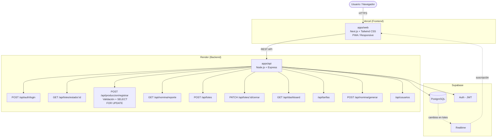

# Arquitectura del Sistema - MaquilaControl

## 1. Visión general

MaquilaControl sigue una arquitectura de **monorepo con separación de capas**.
El repositorio `DWI-proyecto` contiene dos aplicaciones independientes:

- `apps/web` → Frontend (Next.js + Tailwind CSS, PWA)
- `apps/api` → Backend (Node.js + Express)

Ambas comparten el mismo repositorio y ciclo de desarrollo, pero se despliegan
de forma independiente. La base de datos, autenticación y actualizaciones en
tiempo real se gestionan mediante Supabase.

## 2. Diagrama de arquitectura

> **Nota:** Esta versión del diagrama incorpora las correcciones solicitadas
> tras la retroalimentación de la arquitectura del sistema (Supabase Realtime para tiempo real,
> endpoints adicionales, manejo explícito de concurrencia). Es la versión vigente del proyecto.



## 3. Estrategia de autenticación

Se eligió **Supabase Auth como única estrategia de autenticación**, eliminando
la contradicción previa entre JWT manual + bcrypt y Supabase Auth.

- Supabase gestiona internamente el registro, login y hash de contraseñas
  (tabla `auth.users`, no accesible directamente).
- La tabla `usuarios` del esquema público **no almacena `password_hash`**;
  solo guarda el perfil (nombre, email, rol) y referencia el `id` generado
  por `auth.users`.
- El JWT emitido por Supabase Auth incluye el `id` del usuario, que el backend
  usa para consultar su `rol` en la tabla `usuarios` y aplicar control de
  acceso por rol (RBAC) en cada endpoint.

## 4. Solución de tiempo real

Se utiliza **Supabase Realtime** en lugar de WebSockets o polling propios.

- El frontend (`apps/web`) se suscribe a cambios en la tabla `lotes`.
- Cuando `apps/api` actualiza `piezas_acumuladas` dentro de una transacción,
  Supabase Realtime emite el cambio automáticamente a todos los clientes
  suscritos (dashboards de supervisores).
- Esto evita levantar infraestructura adicional de WebSockets y aprovecha
  la misma base de datos como fuente de eventos.

## 5. Manejo de concurrencia

El registro de piezas es la operación más crítica del sistema, ya que varios
operadores pueden reportar piezas sobre el mismo lote al mismo tiempo.

Para evitar condiciones de carrera, el backend ejecuta una **transacción con
bloqueo de fila** usando `SELECT ... FOR UPDATE`:

```sql
BEGIN;

SELECT piezas_acumuladas, total_piezas_requeridas
FROM lotes
WHERE id = $1
FOR UPDATE;

-- Validación en backend:
-- si piezas_acumuladas + piezas_nuevas > total_piezas_requeridas
--    => ROLLBACK, responder 400
-- si no:

UPDATE lotes
SET piezas_acumuladas = piezas_acumuladas + $piezas_nuevas,
    estado_id = CASE
      WHEN piezas_acumuladas + $piezas_nuevas >= total_piezas_requeridas
      THEN (SELECT id FROM estados_lote WHERE nombre = 'cerrado')
      ELSE estado_id
    END
WHERE id = $1;

INSERT INTO registros_produccion (lote_id, usuario_id, piezas_reportadas, tipo_pieza, fecha_registro)
VALUES ($1, $2, $piezas_nuevas, $tipo_pieza, now());

COMMIT;
```

`SELECT ... FOR UPDATE` bloquea la fila del lote durante la transacción. Si un
segundo operador intenta registrar piezas sobre el mismo lote mientras la
primera transacción no ha terminado, su consulta espera hasta que la primera
libere el bloqueo (`COMMIT` o `ROLLBACK`). Esto garantiza que el total del lote
nunca pueda excederse, incluso bajo registros simultáneos.

## 6. Estrategia de tarifas

Las tarifas se definen **por tipo de pieza y con vigencia por periodo**, ya
que en una maquila no todas las piezas se pagan igual y las tarifas pueden
cambiar con el tiempo.

- Cada registro de producción (`registros_produccion`) incluye el campo
  `tipo_pieza`.
- La tabla `tarifas_nomina` define el `pago_por_pieza` según `tipo_pieza` y
  un rango de vigencia (`fecha_inicio_vigencia`, `fecha_fin_vigencia`).
- Al generar nómina, el sistema busca la tarifa vigente para cada tipo de
  pieza en la fecha del registro y calcula:
  `monto = piezas_validadas × tarifa_vigente`.

## 7. Endpoints de la API

### Endpoints base

| Endpoint | Método | Descripción |
|---|---|---|
| `/api/auth/login` | POST | Autenticación vía Supabase Auth, retorna JWT |
| `/api/lotes/estado/:id` | GET | Devuelve piezas totales, acumuladas y disponibles |
| `/api/produccion/registrar` | POST | Registro de piezas con validación de límite (transacción + FOR UPDATE) |
| `/api/nomina/reporte` | GET | Calcula piezas validadas × tarifa, agrupado por operador |

### Endpoints adicionales

| Endpoint | Método | Descripción |
|---|---|---|
| `/api/lotes` | POST | Crear nuevo lote (código, total de piezas, línea, turno) |
| `/api/lotes/:id/cerrar` | PATCH | Cerrar lote manualmente (antes de llegar al límite) |
| `/api/dashboard` | GET | Resumen de producción por línea, turno y operador en tiempo real |
| `/api/tarifas` | GET / POST | Consultar o crear tarifas por tipo de pieza y vigencia |
| `/api/nomina/generar` | POST | Generar una nómina formal para un periodo (crea registro en `nominas_generadas` y `detalle_nomina`) |
| `/api/usuarios` | GET / POST | Listar o crear usuarios y asignar roles (solo administrador) |
